# SmartBudget
The Smart Budget App is a simple and user-friendly web application designed to help individuals effectively manage their personal finances. It allows users to record their income and expenses, categorize transactions, and monitor their spending habits over time.

## 📄 Documents

- [Sprint 1 Deliverables](./scrum/Sprint1.md)
- [Sprint 2 Deliverables](./scrum/Sprint2.md)
- [Spring 3 Deliverables](./scrum/Sprint3.md)
